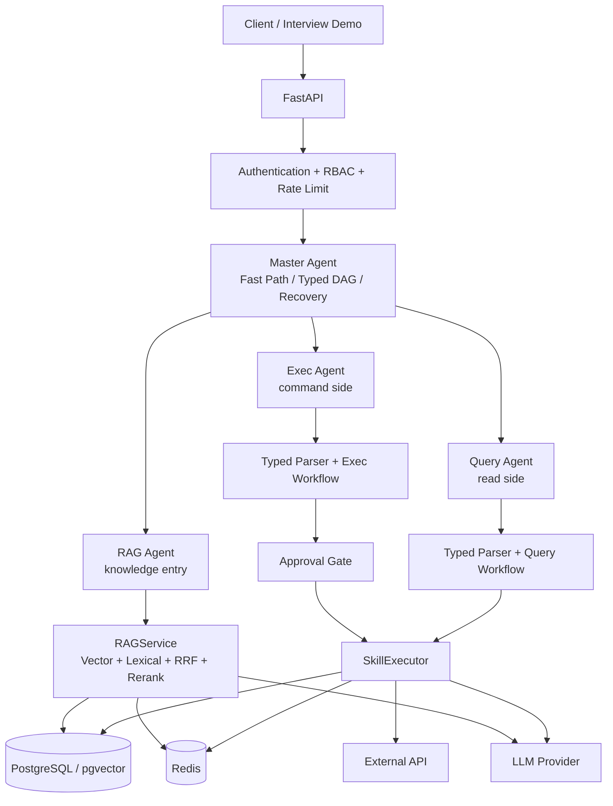

# E-commerce Multi-Agent Matrix

[](https://github.com/wz13814990585-sudo/ecom_agent_matrix/actions/workflows/ci.yml)


> 中文简介：这是一个面向跨境电商运营的多智能体作品集项目，重点展示可验证编排、混合 RAG、租户隔离、人工审批与可观测性，而不是堆叠分布式基础设施。

A production-inspired multi-agent orchestration system for cross-border e-commerce automation, featuring deterministic fast paths, typed DAG planning, hybrid RAG, tenant isolation, human approval, and observability.

## Why this project exists

The project demonstrates software-engineering decisions around AI systems: where deterministic code should replace model judgment, how an LLM-generated plan is constrained by typed validation, how read and write responsibilities remain separate, and how a useful fallback survives an unavailable model or external service.

Only four runtime Agents are registered. Business breadth is expressed through typed parsers, workflows, and skills rather than creating an Agent for every table or use case.

## Architecture



The Agent boundaries are deliberately narrow:

- **Master** owns routing, orchestration, typed planning, dependency execution, and bounded recovery.
- **Query** owns read-side commerce and operational queries. It can execute only explicitly pure read Skills.
- **Exec** owns command/production workflows. High-risk writes pass through a human approval gate.
- **RAG** is the single knowledge-retrieval entry and delegates retrieval/generation to `RAGService`.

See [Architecture details](docs/architecture.md) for the three main execution sequences.

## Design principles

- **Agent = responsibility**
- **Workflow = business orchestration**
- **Skill = atomic capability with a validated contract**
- **Database = source of facts**
- **RAG = source of knowledge**
- **LLM = uncertain judgment or language generation**
- **Code = deterministic rules, permissions, and safety boundaries**

## Execution strategy

A simple, high-confidence request follows a deterministic **Fast Path** to one Agent. It avoids planner latency, token usage, and an unnecessary source of routing uncertainty.

A genuinely composite request uses a validated `MasterPlan`. The plan is a typed DAG with bounded steps, approved Agent/task mappings, cycle validation, dependency-aware concurrency, and explicit upstream context. Failed steps enter bounded recovery; ReAct is recovery-only, not the default execution path.

## Hybrid RAG

`RAGService` independently retrieves vector and lexical candidates, combines them with Reciprocal Rank Fusion, performs one batch rerank, validates citations, and reports grounding status. A deterministic source-context answer remains available when the LLM is unavailable.

The evaluation harness reports HitRate, Recall, MRR, and nDCG from explicit evaluation cases. No retrieval-accuracy claim is made without running that harness on a populated index.

## Security boundary

- Development API-key mode and production JWT mode both create a trusted `SecurityContext`.
- RBAC is checked at ingress and before typed plan execution.
- Tenant/store identity comes from authentication, never from user payload fields.
- PostgreSQL RLS and transaction-local tenant/store scope isolate data.
- Read and write database roles are separated for production configuration.
- High-risk Skills require an exact-parameter, tenant-bound, one-time approval.
- Approval and high-risk execution create audit records.

**An LLM cannot approve a high-risk action.** Approval is an authenticated human/API security decision enforced below the workflow layer.

## Observability and resilience

The runtime propagates root `task_id` and hop-level `correlation_id` through structured JSON logs. Raw queries, prompts, credentials, JWTs, and tenant/user identifiers are excluded or hashed.

`GET /metrics` exposes bounded-label Prometheus metrics for HTTP, Agent, Workflow, Skill, LLM latency, tokens, and configured estimated cost. The runtime also includes process-local rate limiting, bounded transient retries, component-level circuit breakers, dependency timeouts, and bounded graceful shutdown.

## Quick start A: local Python

Prerequisites: Python 3.11, Redis 7, and PostgreSQL 16 with the `pgvector` extension available.

```bash
python -m venv .venv
source .venv/bin/activate
pip install -r ecom_agent_matrix/requirements.txt
cp .env.example .env
```

Edit `.env` with your local PostgreSQL credentials and set:

```dotenv
API_KEY=<your-local-demo-key>
```

With PostgreSQL and Redis running, initialize the existing schema and structured seed data:

```bash
python -m ecom_agent_matrix.scripts.init_db
```

Build the real product embeddings required by the RAG demo, then start the API:

```bash
python -m ecom_agent_matrix.scripts.reembed_vectors --only goods
uvicorn ecom_agent_matrix.api.main:app --host 0.0.0.0 --port 8000
```

The first RAG indexing run may download `BAAI/bge-small-en-v1.5`; the offline script therefore uses a wider 300-second model timeout, configurable with `--timeout`. CI and unit tests do not download embedding or CrossEncoder models. CrossEncoder download remains opt-in; without a local model, reranking uses the deterministic keyword fallback.

## Quick start B: Docker Compose

Docker Compose is the shortest reproducible local interview/demo environment:

```bash
cp .env.example .env
# Edit .env and set API_KEY to your own local demo value.
docker compose -f ecom_agent_matrix/docker/docker-compose.yml up --build -d
curl http://127.0.0.1:8000/health
```

PostgreSQL automatically runs the existing `business_tables.sql` and `vector_tables.sql` only when its data volume is empty. Structured demo rows are included, but the vector table still needs real embeddings:

```bash
docker compose -f ecom_agent_matrix/docker/docker-compose.yml exec api \
  python -m ecom_agent_matrix.scripts.reembed_vectors --only goods
```

The indexing command may download the embedding model on its first run. To completely reset the local demo database and rerun entrypoint initialization:

```bash
docker compose -f ecom_agent_matrix/docker/docker-compose.yml down -v
docker compose -f ecom_agent_matrix/docker/docker-compose.yml up --build -d
```

Application startup never silently alters an existing production database.

## Four interview demos

Set the values for your running environment:

```bash
export BASE_URL=http://127.0.0.1:8000
export DEMO_API_KEY=your-local-demo-key
```

1. **Simple Query Fast Path** — `goods_search` routes directly to Query and reads the seeded SKU.
2. **Knowledge RAG** — the waterproof bag query uses populated product knowledge and can return validated `[S1]` citations.
3. **Composite DAG** — order context and policy context execute independently before the Exec CRM step consumes both.
4. **Risk Approval** — a deterministic amount threshold creates `APPROVAL_REQUIRED`; approval and exact resubmission perform one write.

Copyable requests and response-shape guidance are in [Demo guide](docs/demo.md). The examples describe response structure rather than fabricated latency, throughput, accuracy, or cost results.

The existing smoke runner exercises the same flows:

```bash
python -m ecom_agent_matrix.scripts.smoke_e2e --transport http --mode fast-path --api-key "$DEMO_API_KEY"
python -m ecom_agent_matrix.scripts.smoke_e2e --transport http --mode rag --api-key "$DEMO_API_KEY"
python -m ecom_agent_matrix.scripts.smoke_e2e --transport http --mode composite --api-key "$DEMO_API_KEY"
python -m ecom_agent_matrix.scripts.smoke_e2e --transport http --mode risk --api-key "$DEMO_API_KEY"
```

If no real LLM is configured, supported workflows use deterministic/template fallbacks and report degraded source metadata instead of treating a model call as successful.

## Deterministic benchmark

`benchmark_demo.py` measures only deterministic Master routing. It does not call the full API, PostgreSQL, Redis, or a real LLM and must not be interpreted as a production benchmark.

```bash
python -m ecom_agent_matrix.scripts.benchmark_demo -n 100
```

## Project structure

```text
ecom_agent_matrix/
  api/                 FastAPI ingress and schemas
  core/                MCP, task, security, Skill contracts, LLM abstraction
  modules/             four Agents, typed parsers, workflows, Skills, RAGService
  platform/            observability and resilience
  db/                  schema, RLS migration, and database clients
  scripts/             initialization, indexing, smoke, and benchmark tools
  docker/              local demo image and Compose environment
test/                   unit, contract, security, RAG, DAG, and resilience tests
eval/                   RAG evaluation case format
docs/                   architecture, demo, operations, and interview notes
```

## Testing strategy

The test suite covers unit behavior, Skill contracts, typed workflows, Master Fast Path/DAG/recovery, RAG retrieval/citations/evaluation, security/RBAC/approval/RLS contracts, observability, and resilience. External services and model downloads are mocked in default tests. Database/Redis integration checks remain optional and are not required by CI.

```bash
python -m compileall -q ecom_agent_matrix
ruff check ecom_agent_matrix test --select E9,F63,F7,F82
pytest -q
```

## Architecture trade-offs

The runtime intentionally uses a **single-process asyncio message bus**. At portfolio/demo scale this lowers operational complexity, makes behavior reproducible, and keeps attention on orchestration and safety semantics. The `MessageBus` boundary permits a future Redis Streams or RabbitMQ transport without changing the Agent responsibilities, but no distributed transport is implemented here.

Production deployment target is intentionally not configured. GitHub Actions is an automated quality gate, while the hardened Docker image is the deployment artifact; there is no fake CD workflow.

## Limitations and future work

- The message bus, rate limiter, circuit-breaker state, and request correlation registry are process-local.
- No distributed transport, multi-process coordination, or cloud deployment target is included.
- Demo RAG model loading and indexing are local and can be slow on the first run.
- Production operations would need managed secrets, production DB roles/migrations, durable message transport where justified, and deployment-specific SLOs.

For concise design rationale and interview answers, see [Interview notes](docs/interview_notes.md).
