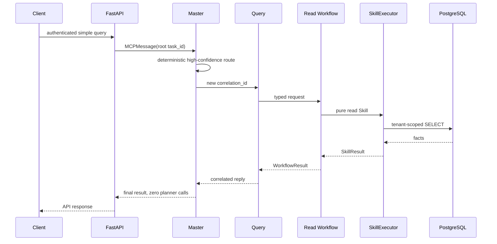
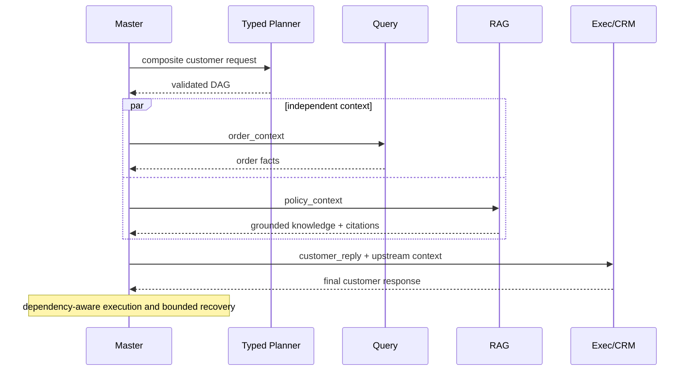
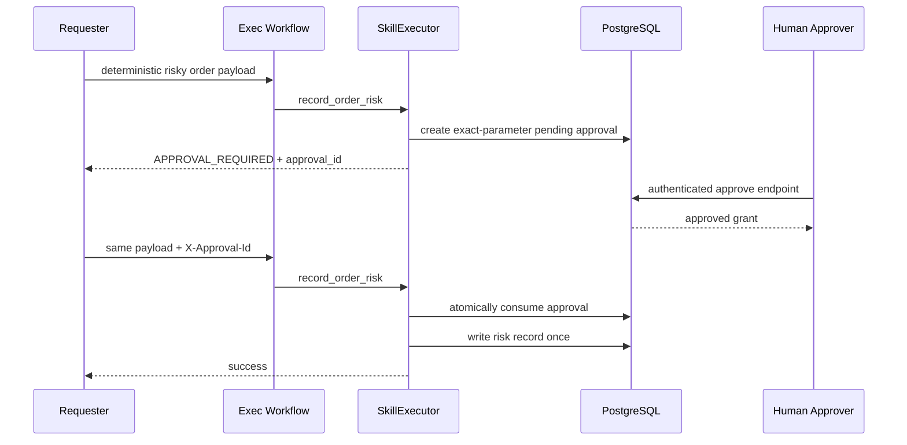

# Architecture sequences

The system has four runtime Agents. Workflows and Skills provide business variety without weakening those responsibility boundaries.

## Simple Fast Path

## Composite Typed DAG

## Risk approval

The LLM never participates in approval. Tenant identity, required scopes, parameter hashes, expiry, and one-time consumption are deterministic security controls.
